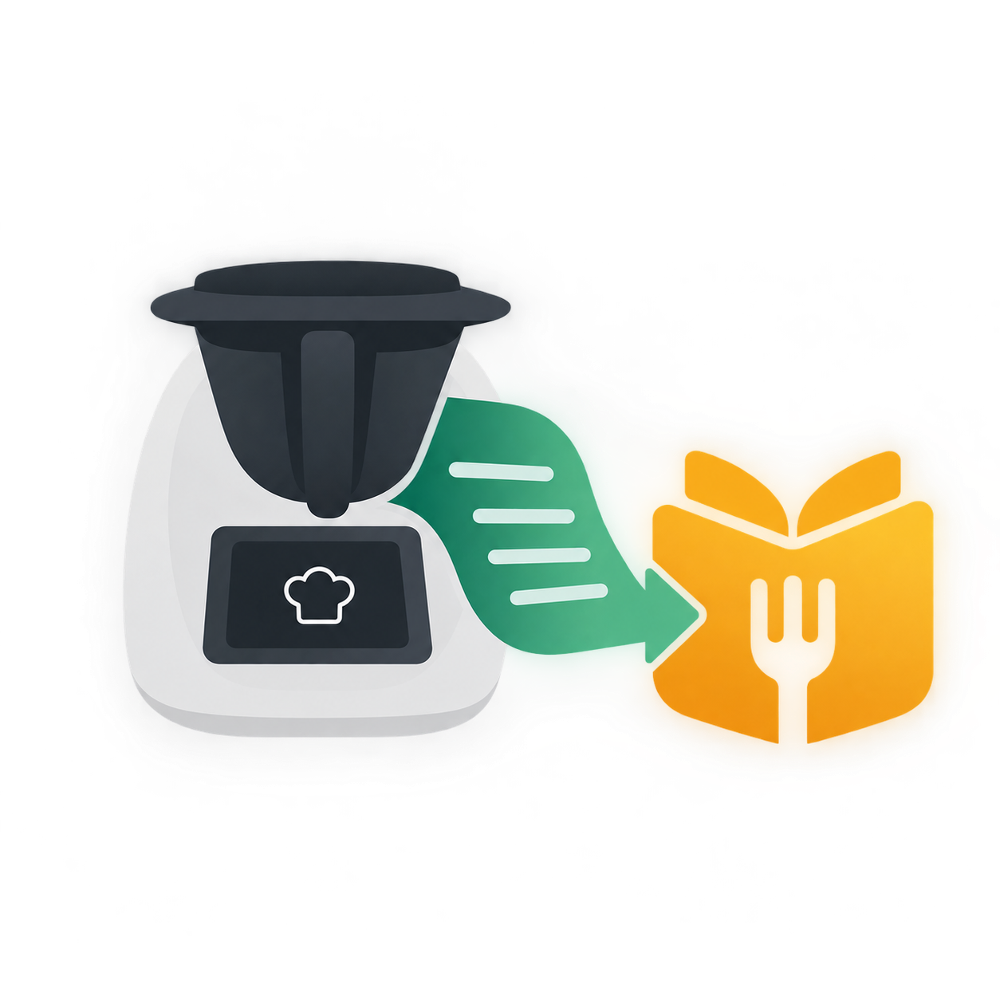

<p align="center">
  
</p>

# Cookistash

[](https://github.com/afonsoc12/cookistash/actions/workflows/canary.yml)
[](https://codecov.io/gh/afonsoc12/cookistash)
[](https://github.com/afonsoc12/cookistash/releases/latest)

> 🥘 Scrapes recipes from [Cookidoo](https://cookidoo.thermomix.com/) (Bimby/Thermomix) — with optional sync to [Mealie](https://mealie.io/).

**Cookistash** is a Cookidoo recipe scraper first. Sending recipes to Mealie is an addon that only switches on once you configure a Mealie source — no Mealie instance required to just scrape and keep recipes.

## ✨ Features

- 🔎 **Scrape by ID or link** — paste a Cookidoo recipe URL or ID, get back parsed ingredients, instructions, nutrition, categories, tags and tools
- 🔗 **Optional Mealie sync** — push any scraped recipe to a self-hosted Mealie instance; only active once configured, never required
- 🧠 **Correctly-split ingredients** — quantity/unit/food built from Cookidoo's own structured data, not Mealie's English-oriented NLP parser (which mis-segments non-English units with high confidence)
- ♻️ **Idempotent sync** — re-sending an unchanged recipe is a no-op (content-hash based), so scheduled rescrapes don't hammer Mealie's API for nothing
- ⏰ **Scheduled rescrapes** — nightly job (django-celery-beat, DB-backed and editable in-admin) keeps stale recipes fresh
- 🖥️ **Explorer UI** — browse scraped recipes, see sync status, re-scrape or send-to-Mealie with one click, drill into raw scraped JSON
- 🎨 **Modern admin** — Django admin re-themed with Unfold, task results and periodic tasks linked back to the recipe they belong to
- 🐳 **Single, lightweight container** — Django (gunicorn + WhiteNoise) + one Celery worker (with beat baked in), one image, ~115 MB (Alpine + Python 3.14)

## 🚀 Quick Start

```bash
docker compose up --build -d
```

This starts:

| Service | Purpose | URL |
|---|---|---|
| `app` | Django (gunicorn + WhiteNoise) + Celery worker/beat (supervisord) | [localhost:8000](http://localhost:8000) (UI + Admin) |
| `postgres` | Database (separate `cookistash` and `mealie` DBs) | — |
| `redis` | Celery broker | — |
| `mealie` | Recipe manager (optional, for sync) | [localhost:9000](http://localhost:9000) |

Migrations run automatically on container start.

### First-time setup

1. Set `COOKIDOO_EXPLORE_URL` (see below) and restart — the Cookidoo source is created/updated automatically on every container start, no admin step needed. Cookidoo has a separate domain per market (`cookidoo.pt`, `cookidoo.co.uk`, `cookidoo.thermomix.com`, ...) with no cross-market API, so only one Cookidoo source is supported at a time.
2. *(Optional)* To enable Mealie sync: log into Mealie with the default admin (`changeme@example.com` / `MyPassword`), change the password, generate an API token (Profile → API Tokens), then set `MEALIE_API_URL`/`MEALIE_API_TOKEN` (see below) and restart — same auto-create/update behavior as the Cookidoo source, and also single-source only.
3. Use the UI to scrape a recipe by ID or pasted link, or browse **Discover**. **Send to Mealie** only appears once a Mealie source is configured.

## ⚙️ Configuration

All configuration is via environment variables (see `docker-compose.yml`).

| Variable | Description | Default |
|---|---|---|
| `COOKIDOO_EXPLORE_URL` | Cookidoo "explore" page URL for your market, e.g. `https://cookidoo.pt/foundation/pt-PT/explore` — domain and locale are parsed from it and used to create/update the single `cookidoo.Source` on every container start | unset — no source is configured until this is set, nothing is assumed |
| `MEALIE_API_URL` / `MEALIE_API_TOKEN` | Mealie server-to-server API URL (e.g. `http://mealie:9000`) and an API token generated in Mealie's UI — used to create/update the single `mealie.Source` on every container start | unset — Mealie sync stays disabled until both are set |
| `MEALIE_PUBLIC_URL` / `MEALIE_GROUP_SLUG` | Browser-facing Mealie URL (for links in the UI, falls back to `MEALIE_API_URL`) and the Mealie group slug used to build recipe links | unset / `home` |
| `DB_HOST` / `DB_NAME` / `DB_USER` / `DB_PASSWORD` / `DB_PORT` | Postgres connection | `localhost` / `cookistash` / `postgres` / `postgres` / `5432` |
| `CELERY_BROKER_URL` | Redis broker URL | `redis://localhost:6379/0` |
| `CELERY_RESULT_BACKEND` | Celery result backend | `django-db` |
| `DEBUG` | Django debug mode | `true` |
| `SECRET_KEY` | Django secret key, signs sessions/CSRF tokens | unset — no need to set this: auto-generated on first run and persisted to `DATA_DIR/.secret_key` |
| `DATA_DIR` | Where runtime-generated state (currently just `.secret_key`) is persisted - needs to survive the container being replaced on every image upgrade, unlike the rest of `/app` | `/data` in docker-compose (bind-mounted to `./tmp/docker-data/app-data`) / repo root otherwise |
| `ALLOWED_HOSTS` | Comma-separated allowed hosts | `*` |
| `CSRF_TRUSTED_ORIGINS` | Comma-separated origins (with scheme, e.g. `https://cookistash.example.com`) trusted for POST requests - needed if you put another reverse proxy in front that doesn't forward the original Host header | unset |
| `AUTO_ADMIN_LOGIN` | Skip the admin login form, auto-authenticate as the superuser | `true` — **only safe on localhost/private networks**, set `false` if ever exposed |

You don't need to set `SECRET_KEY` yourself (see above), but if you'd rather pin one explicitly, generate a long, cryptographically random one with:

```bash
openssl rand -hex 64
```

## 🖥️ UI

Lists scraped recipes with their scrape/sync status. Click a recipe for parsed ingredients, instructions, nutrition, categories/tags/tools, and the raw scraped JSON. Each row has:

- **↻ Re-scrape** — re-fetches the recipe from Cookidoo
- **→ Send to Mealie** — transforms the latest scrape and pushes it to Mealie (only shown when Mealie is configured)

## ⏰ Scheduled Jobs

Managed via django-celery-beat — DB-backed, editable at `/admin/django_celery_beat/periodictask/` without a redeploy. A nightly rescrape job (03:00, recipes not scraped in 7 days) is auto-seeded on first migrate.

## 🐳 Docker Details

Multi-stage build, Alpine + Python 3.14. `psycopg2` compiles from source in the builder stage (no musllinux wheel available) and never ships in the runtime image. ~115 MB total.

The `app` container runs two processes under supervisord: [gunicorn](https://gunicorn.org/) (1 worker; `manage.py runserver` is never used) serving Django directly with [WhiteNoise](http://whitenoise.evans.io/) for `/static/`, and a single Celery worker with beat baked in, running a single-process `solo` pool instead of forking a child per CPU core (`celery worker -B --pool=solo`). No nginx, no separate beat process, no per-core worker forking, no always-on Flower — kept deliberately minimal so it runs comfortably inside small resource limits (e.g. a 256Mi-512Mi Kubernetes pod). Flower is still available as an on-demand tool if you need to inspect Celery tasks:

```bash
docker compose exec app celery -A cookistash flower --port=5555
# then visit localhost:5555 (add -p 5555:5555 to the app service to expose it)
```

```
ENTRYPOINT ["/entrypoint.sh"]
CMD ["supervisord", "-c", "/etc/supervisor/conf.d/supervisord.conf", "-n"]
```

## 🛠️ Development

Two ways to run it, pick whichever suits what you're doing:

**Full stack via Docker** — closest to how it actually runs, but no hot reload:
```bash
docker compose up --build -d
```

**Django's dev server against dockerized Postgres/Redis** — hot reload, faster iteration on Python/template changes:
```bash
docker compose up -d postgres redis   # just the backing services
uv sync --all-groups                  # install app + dev deps (ruff, mypy, pytest-cov, pytest-bdd)
uv run python manage.py migrate
uv run python manage.py sync_cookidoo_source   # if COOKIDOO_EXPLORE_URL is set
uv run python manage.py runserver
```
`DB_HOST`/`CELERY_BROKER_URL` already default to `localhost`, matching the ports docker-compose exposes, so no extra env vars are needed for this path.

```bash
uv run ruff format     # format
uv run ruff check      # lint
uv run mypy cookistash/
```

## ✅ Tests

```bash
uv run pytest -m "not e2e"   # unit tests, with coverage (see htmlcov/index.html)
```

Requires a reachable Postgres (`DB_HOST=localhost DB_NAME=cookistash` works against the docker-compose `postgres` service).

`tests/e2e/` runs the real scrape → transform → sync pipeline (pytest-bdd/Gherkin) against live docker-compose services — see `tests/e2e/README.md`. Excluded from the default run and from CI; run explicitly with `-m e2e`.

## 🔁 CI & Releases

`.github/workflows/ci.yml` runs ruff (format + lint), mypy, and the unit test suite with coverage (uploaded as a build artifact). e2e tests are skipped (they need live services CI doesn't spin up).

`.github/workflows/canary.yml` runs CI, then builds/pushes a Docker image on every push to `main`, tagged `ghcr.io/afonsoc12/cookistash:dev` and `:{version}-dev-{sha}`, plus a GitHub prerelease with notes pulled from `CHANGELOG.md`'s `[Unreleased]` section.

To cut a real release, manually trigger `.github/workflows/prepare-release.yml` (Actions tab → pick a `patch`/`minor`/`major` bump) — it bumps the version, moves `CHANGELOG.md`'s `[Unreleased]` section to `[X.Y.Z] - <date>`, commits that to `main`, builds the wheel/sdist and multi-arch Docker image (`ghcr.io/afonsoc12/cookistash:{version}` + `:latest`), and only then publishes the GitHub Release with everything already attached.

## 🗺️ Roadmap

- [x] Browse/search Cookidoo's catalog and import without needing a recipe ID first — see **Discover**
- [ ] Bulk import (Discover imports one recipe at a time; `CookidooClient.get_country_recipes()` exists for full-catalog fetches but has no task/UI wrapper yet)
- [ ] Retry/backoff on Celery tasks and outbound HTTP calls
- [ ] Rate limiting on collection scraping
- [ ] Search by ingredient in the Explorer (currently name only - Discover's own search already covers Cookidoo-side keyword search)

## 📄 License

**Copyright © 2026 [Afonso Costa](https://github.com/afonsoc12)**

Licensed under the MIT License. See the [LICENSE](./LICENSE) file for details.
