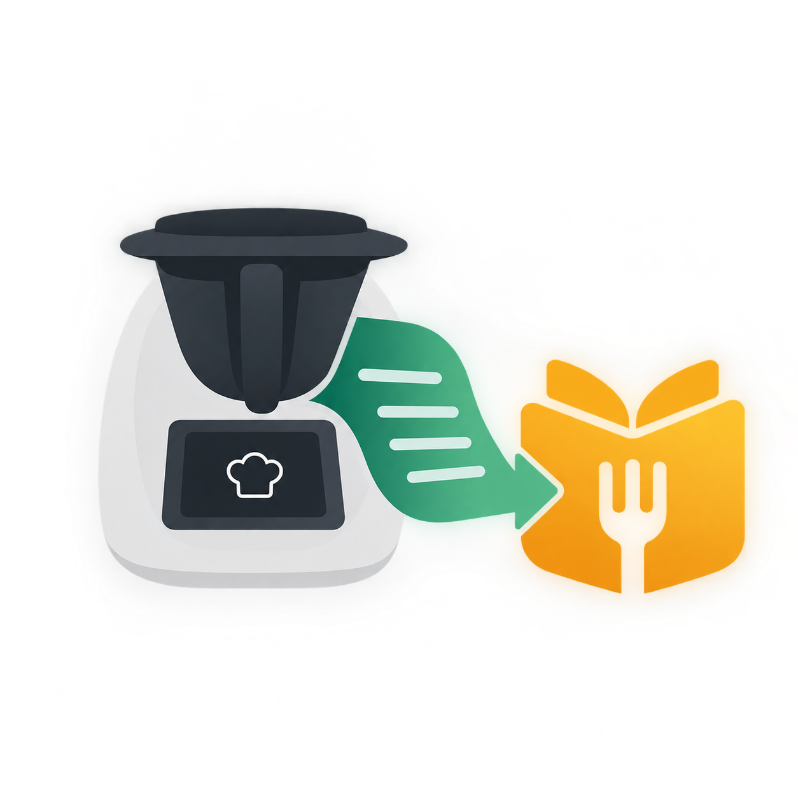

<p align="center">
  
</p>

# Cookistash

<p align="center"><strong style="font-size: 1.2em;">🥘 Stash your Cookidoo recipes and sync them to Mealie.</strong></p>

<p align="center">
  <a href="https://github.com/afonsoc12/cookistash/actions/workflows/release.yml"></a>
  <a href="https://codecov.io/gh/afonsoc12/cookistash"></a>
  <a href="https://github.com/afonsoc12/cookistash/releases/latest"></a>
  <a href="./LICENSE"></a>
</p>

**Cookistash** is a Cookidoo recipe explorer and scraper, with an option to send to [Mealie](https://mealie.io/) (no Mealie instance required).

## ✨ Features

- 🧭 **Discover or paste a link/ID** — browse Cookidoo's own catalog and import recipes without needing an ID first, or paste a Cookidoo recipe URL/ID to get back parsed ingredients, instructions, nutrition, categories, tags and tools
- 🔗 **Optional Mealie sync** — push any scraped recipe to a self-hosted Mealie instance; only active once configured, never required
- 🧠 **Correctly-split ingredients** — quantity/unit/food built from Cookidoo's own structured data, not Mealie's English-oriented NLP parser (which mis-segments non-English units with high confidence)
- ♻️ **Idempotent sync** — re-sending an unchanged recipe is a no-op (content-hash based), so scheduled rescrapes don't hammer Mealie's API for nothing
- ⏰ **Scheduled rescrapes** — a nightly job keeps stale recipes fresh, schedule editable from the admin
- 🖥️ **Explorer UI** — browse scraped recipes, see sync status, re-scrape or send-to-Mealie with one click, drill into raw scraped JSON
- 🎨 **Modern admin** — Django admin re-themed with Unfold, task results and periodic tasks linked back to the recipe they belong to
- 🐳 **Single, lightweight container** — one small image (~115 MB), runs comfortably on modest hardware

## 🚀 Installation

You need Docker. Postgres and Redis each run as their own container, defined alongside the app in the same `docker-compose.yml`.

```bash
docker compose up -d
```

Once it's up:

| Service | What it's for | URL |
|---|---|---|
| `cookistash` | The web app + background worker | [localhost:8000](http://localhost:8000) (UI + Admin) |
| `postgres` | Database (separate `cookistash` and `mealie` DBs) | — |
| `redis` | Celery broker | — |
| `mealie` | Recipe manager (optional, for sync) | [localhost:9000](http://localhost:9000) |

Migrations run automatically the first time the app container starts.

### First-time setup

1. Set `COOKIDOO_EXPLORE_URL` (see [Configuration](#-configuration)) and restart — the Cookidoo source is set up automatically, no admin step needed.
2. *(Optional)* To enable Mealie sync: log into Mealie with the default admin (`changeme@example.com` / `MyPassword`), change the password, generate an API token (Profile → API Tokens), then set `MEALIE_API_URL`/`MEALIE_API_TOKEN` and restart.
3. Use the UI to scrape a recipe by ID or pasted link, or browse **Discover**. **Send to Mealie** only appears once a Mealie source is configured.

## ⚙️ Configuration

Everything is configured through environment variables in `docker-compose.yml`.

| Variable | Description | Default |
|---|---|---|
| `COOKIDOO_EXPLORE_URL` | Your Cookidoo market's "explore" page URL, e.g. `https://cookidoo.pt/foundation/pt-PT/explore` | unset — scraping is disabled until this is set |
| `MEALIE_API_URL` / `MEALIE_API_TOKEN` | Mealie's API URL (e.g. `http://mealie:9000`) and an API token from Mealie's UI | unset — Mealie sync stays disabled until both are set |
| `MEALIE_PUBLIC_URL` / `MEALIE_GROUP_SLUG` | Browser-facing Mealie URL (for links in the UI) and your Mealie group slug | unset / `home` |
| `DB_HOST` / `DB_NAME` / `DB_USER` / `DB_PASSWORD` / `DB_PORT` | Postgres connection | `localhost` / `cookistash` / `postgres` / `postgres` / `5432` |
| `CELERY_BROKER_URL` | Redis broker URL | `redis://localhost:6379/0` |
| `CELERY_RESULT_BACKEND` | Celery result backend | `django-db` |
| `DEBUG` | Django debug mode | `true` |
| `SECRET_KEY` | Signs sessions/CSRF tokens | unset — auto-generated and persisted on first run, no need to set it yourself |
| `DATA_DIR` | Where persistent state is stored, so it survives container upgrades | `/data` (bind-mounted to `./tmp/docker-data/app-data`) |
| `ALLOWED_HOSTS` | Comma-separated allowed hosts | `*` |
| `CSRF_TRUSTED_ORIGINS` | Comma-separated origins (with scheme) trusted for form submissions — set this if you're behind a reverse proxy | unset |
| `AUTO_ADMIN_LOGIN` | Skip the admin login form, auto-authenticate as the superuser. If no superuser exists yet, one is created automatically (see `ADMIN_USERNAME`/`ADMIN_PASSWORD`) | `true` — **only safe on localhost/private networks**, set `false` if ever exposed |
| `ADMIN_USERNAME` | Username for the superuser auto-created when `AUTO_ADMIN_LOGIN` is enabled and none exists yet | `admin` |
| `ADMIN_PASSWORD` | Password for that auto-created superuser | `admin` |

If you'd rather set `SECRET_KEY` explicitly instead of letting it auto-generate, create one with:

```bash
openssl rand -hex 64
```

## 🖥️ Using Cookistash

The Explorer lists everything you've scraped along with its sync status. Click a recipe to see its parsed ingredients, instructions, nutrition, categories/tags/tools, and the raw scraped data. Each recipe has two actions:

- **↻ Re-scrape** — fetch the latest version from Cookidoo
- **→ Send to Mealie** — push the latest scrape to Mealie (only shown once Mealie is configured)

A nightly job keeps everything fresh automatically.

## 🗺️ Roadmap

- [x] Browse/search Cookidoo's catalog and import without needing a recipe ID first — see **Discover**
- [ ] Bulk import (import more than one recipe at a time)
- [ ] Retry/backoff on background jobs and outbound requests
- [ ] Delete a recipe from Mealie directly from Cookistash

## 📄 License

**Copyright © 2026 [Afonso Costa](https://github.com/afonsoc12)**

Licensed under the MIT License. See the [LICENSE](./LICENSE) file for details.
